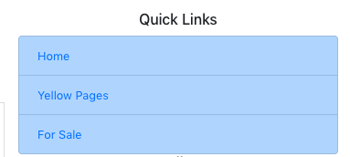

# lodos
craigslist clone, quora clone, gumtree clone, upvotes, downvotes, mern full stack app

Lodos is a single page application developed using mern stack. You will need to sign up and verify your account, 
to be able to ask questions on the platform or post on yellowpages.

The Recent Yellow Pages component on the right side of the page, will list out 5 last post of 5 random users.

Also, the Popular Questions component on the right side of the page lists out 5 most popular questions that are asked past 3 days.
It will remove the specific question when a single question is being viewed.
(Posts that may have answers or voted high)

QuickLinks component on the ride has been placed as a reference and links do not work as of now. To be worked on in the future.

#Features

1.Sign in, Sign up with email verification.
2.Posting Questions, with ability to upvote, downvote or answer.
3.Posting ads on relevant categories.
4.Updating-deleting user created entries.
